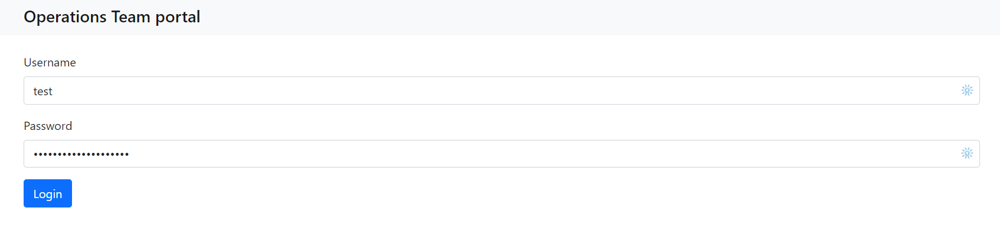
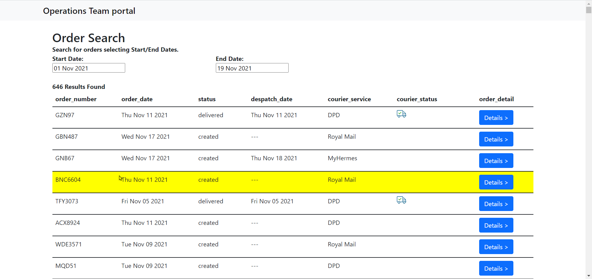
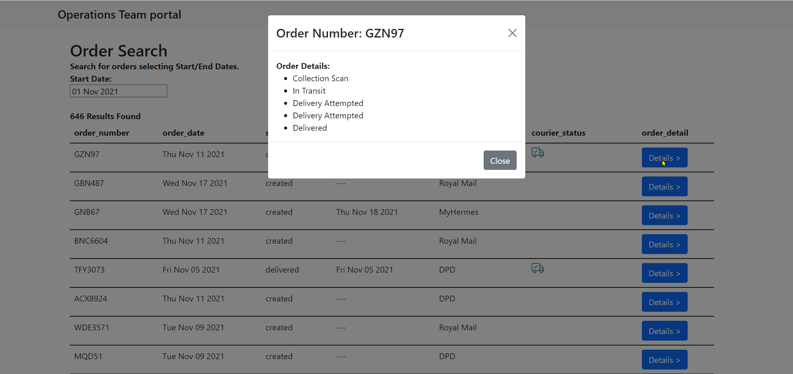
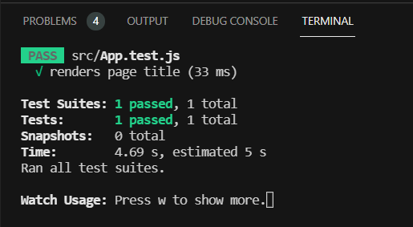

# React Logistics Portal MVP
__[Live Link](https://xenodochial-lamarr-0524dc.netlify.app/)__
<br />


## Features
- Bootstrap template
- Bootstrap modal popup for order details
- Bootstrap alert messages
- Axios for secure API fetching
- SASS
- React date range picker 
- Bearer Token Authentication
- React unit test to check h1 text load
- Data preloading animation
- .env vars


<br />

## Run
````cmd
npm install
npm start
````




## Testing
__React Testing Library__
<br /><br />
run `npm test` to perform testing
<br />
Basic test to check page h1 title loads.
<br />
